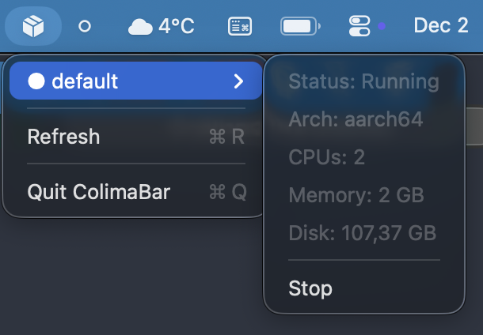

# ColimaBar

A native macOS menu bar app for [Colima](https://github.com/abiosoft/colima) - the container runtime for macOS.



## Features

- Shows all Colima instances in the menu bar
- Start/Stop each instance individually
- View instance details (arch, CPUs, memory, disk)
- Auto-refreshes status every 5 seconds
- Lightweight, native Swift implementation

## Requirements

- macOS 13.0+
- [Colima](https://github.com/abiosoft/colima) installed (`brew install colima`)

## Installation

### From DMG

Download the latest release DMG and drag ColimaBar to your Applications folder.

### Build from Source

```bash
git clone https://github.com/yourusername/colimabar.git
cd colimabar
./build-app.sh
open ColimaBar.app
```

To create a DMG:

```bash
./build-dmg.sh
```

## Usage

Once running, ColimaBar appears in your menu bar:

- **Filled box icon** - Colima is running
- **Empty box icon** - Colima is stopped

Click the icon to:
- View all Colima instances
- Expand instance submenu for details and controls
- Start or Stop individual instances
- Refresh status manually
- Quit the app

### Keyboard Shortcuts

| Shortcut | Action |
|----------|--------|
| R | Refresh Status |
| Q | Quit |

## License

MIT License - see [LICENSE](LICENSE) for details.
